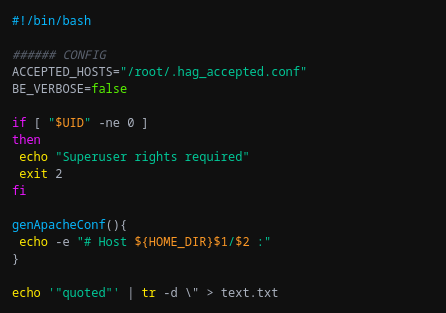
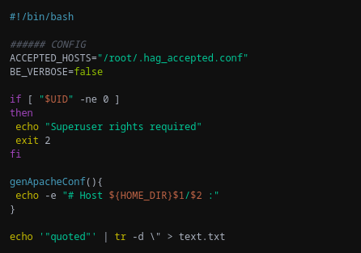
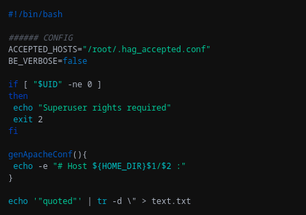
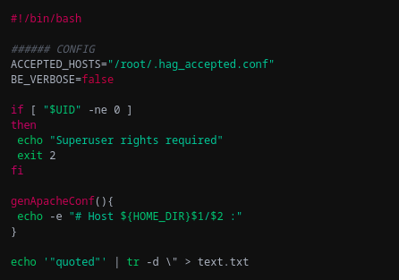

# Cybertopia theme for highlight.js

> Dark theme (and several variants) for [highlight.js](https://highlightjs.org/)

Variant | Preview
--- | ---
Cybertopia Saturated | 
Cybertopia Dimmer | 
Cybertopia Icecap | 
Cybertopia Cherry | 

## Install

### Using git

Copy the source repository:

```zsh
git clone https://github.com/noraj/cybertopia-highlightjs.git
```

### Manually

Download the [GitHub .zip](https://github.com/noraj/cybertopia-highlightjs/archive/master.zip) and uncompress it.

## Activating the theme

1. Copy `cybertopia-<variant>.css` to the desired directory.
2. Include the theme in the HTML file: `<link rel="stylesheet" href="cybertopia-<variant>.css">`.

For more information on how to use, see [highlight.js usage](https://highlightjs.org/#usage) and [how to use documentation](https://highlightjs.readthedocs.io/en/latest/readme.html#basic-usage).

## Demo

```zsh
# Copy the source repository
git clone https://github.com/noraj/cybertopia-highlightjs.git
# Start a HTTP server…
# …with ruby…
ruby -run -e httpd -- cybertopia-highlightjs
# …or with python.
python -m http.server -d cybertopia-highlightjs -b 127.0.0.1 8080
# Then access the demo page with your web browser
xdg-open http://127.0.0.1:8080/demo/
# Optionally edit the stylesheet to change the theme variant
```